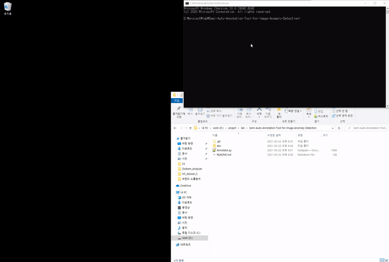

# Semi-Auto-Annotation-Tool-for-Image-Anomaly-Detection
This is Semi Auto Annotation Tool for Image Anomaly Detection.

## What is it?

This program will collect negative/positive image patches.

Input : your effort for drawing some polygons

Output : negative/positive sample image patches, mask images, annotations

## requirements

- PyQt5

- opencv-python

- numpy

## How to use

### Setting

- `python Annotator.py`

- First, choose a directory contains more than one image.

- Second, adjust canvas size depends on your monitor resolution.

- Third, click start cropping button.

### Cropping

- You can draw polygons on the canvas.
- You can adjust crop size and stride. Try example button.
- Click Go! button to automatically crop the image.
- The result will be saved under `results/{image directory}`. There will be `annotations`,  `mask`, `neg_mask`, `negative`, `positive` directories.

## Demo

## End

If you have any trouble using this program, please use issue tab.

Thank you.

